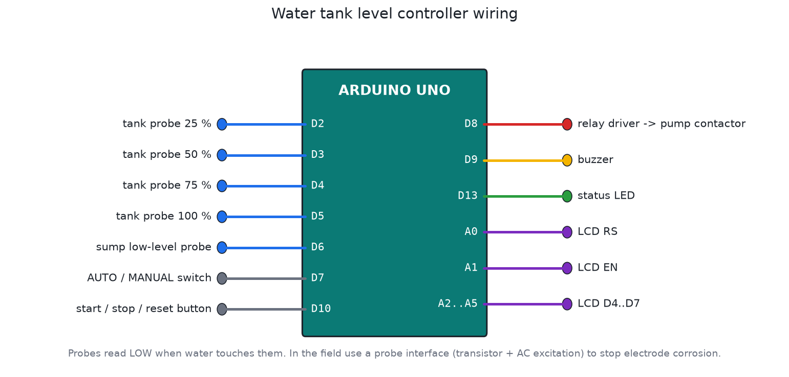

# Proteus projects

[](https://github.com/sprasapradip/proteus-project/actions/workflows/firmware.yml)


Electronics projects I've designed and simulated in Proteus. They start with my first power supply and op-amp circuits from 2023 and go up to firmware for real installations, like the traffic controller for 8 junctions. Every microcontroller project comes with its source, a ready HEX file for Proteus, wiring diagrams and an automatic simulator test.

I'm Pradip Subedi, an electrical engineer from Nepal. Most of these projects solve problems I actually see around me: water tanks on every roof, load shedding, LPG in every kitchen, and junctions with no signals.

## Projects

| # | Project | What's inside | Status |
|---|---|---|---|
| 01 | [5 V regulated power supply](projects/01-5v-regulated-power-supply) | Transformer, bridge, 7805. Simulation + 2 PCB layouts with 3D view | Schematic, PCB. Capacitor values need fixing (see README) |
| 02 | [Op-amp LED flasher](projects/02-opamp-led-flasher) | LM741 astable, 9 V, PCB | Schematic, PCB |
| 03 | [SCR latch circuit](projects/03-scr-latch-circuit) | Thyristor latch with trigger and reset, metered version | Schematic, PCB |
| 04 | [8051 7-segment display](projects/04-8051-7segment-display) | 80C51 multiplexing 8 digits | Schematic. Firmware missing |
| 05 | [LED matrix scrolling display](projects/05-led-matrix-scrolling-display) | Arduino + MAX7219 chain, MD_Parola, serial message input | Runs in Proteus |
| 06 | [Gas / smoke detector with SMS](projects/06-gas-smoke-detector-gsm) | MQ-2, MQ-3, SIM900, exhaust fan, gas valve servo | Firmware v2, tested |
| 07 | [Traffic light controller, 8 sites](projects/07-traffic-light-controller) | 4-way junction, conflict monitor, pedestrian, night, emergency, field install guide | Firmware v2, tested |
| 08 | [Water tank level controller](projects/08-water-tank-level-controller) | 4-level probes, sump dry-run, no-rise and max-run protection, LCD | New, tested |
| 09 | [Smart street light](projects/09-smart-street-light) | LDR + PIR, dusk/dawn filtering, motion boost, late-night dimming | New, tested |
| 10 | [DC power & energy meter](projects/10-dc-power-energy-meter) | V, A, W, Wh, CSV log, OV/OC/short/low-battery cut-off | New, tested |

<p>
  
  
  
</p>

## Repository layout

```
proteus-project/
├── projects/
│   └── NN-project-name/
│       ├── README.md          what it does, how to run it, design notes
│       ├── proteus/           .pdsprj files (and anything they load)
│       ├── firmware/
│       │   ├── <sketch>/      Arduino source (+ libs.txt if it needs libraries)
│       │   └── build/         ready HEX files for Proteus or a real board
│       ├── images/            wiring diagrams and schematics (PNG)
│       └── test/sim_test.c    simulator test
├── tools/
│   ├── build_firmware.sh      sketch -> HEX, pinned Arduino core and libraries
│   ├── build_all.sh           rebuilds every HEX in the repo
│   ├── test_all.sh            runs every simulator test
│   ├── make_diagrams.py       redraws the PNG diagrams
│   └── sim/simtest.h          small simavr helper the tests share
└── .github/workflows/         CI: build everything and run the tests on every push
```

## Getting started

You need Proteus 8 (8.13 or newer recommended) from [Labcenter](https://www.labcenter.com/).

```bash
git clone https://github.com/sprasapradip/proteus-project.git
```

For an analog project (01 to 04), open the `.pdsprj` in its `proteus/` folder and press Run.

For an Arduino project (05 to 10), open the project's README. Either the `.pdsprj` already points at the HEX, or the README tells you which HEX to put in the Arduino's **Program File** property. The `_sim_x5` / `_sim_x10` HEX files run the long timers faster, so a demo doesn't take 20 minutes.

To flash a real board:

```bash
avrdude -p m328p -c arduino -P /dev/ttyUSB0 -b 115200 -U flash:w:projects/08-water-tank-level-controller/firmware/build/water_level_controller.hex:i
```

You can also open the `.ino` in the Arduino IDE and upload it as usual.

## Building and testing without the Arduino IDE

On Linux or WSL:

```bash
sudo apt-get install gcc-avr avr-libc binutils-avr simavr libsimavr-dev libelf-dev
tools/build_all.sh     # rebuild every HEX
tools/test_all.sh      # run every simulator test
```

The tests load the real compiled firmware into simavr (an AVR simulator), drive the inputs on a timeline (switches, sensor voltages, a PIR), and check the outputs every millisecond. For the traffic controller that includes checking that two crossing greens never light together. GitHub Actions runs the same two scripts on every push. The badge at the top shows the result.

The Arduino core (1.8.6) and every library are pinned to exact versions in `tools/build_firmware.sh`, so a rebuild next year produces the same firmware.

## About the 2023 files

In October 2026 I cleaned this repo up. I gave every project its own numbered folder with clear file names, and removed the Proteus autosaves, backups, per-PC workspace files and autorouter scratch files. A `.gitignore` now keeps them out. Nothing is really lost: the repo exactly as it was before the cleanup is commit [`7db3a51`](https://github.com/sprasapradip/proteus-project/tree/7db3a51), and `git checkout 7db3a51` brings it all back.

## License

Copyright (c) 2023-2026 Pradip Subedi. **All rights reserved.**

This is not open source. You can look at it here on GitHub, but you may not copy, modify, flash, install, sell or reuse any part of it (code, firmware, Proteus files, PCB layouts, diagrams or documentation) without my written permission. See [LICENSE](LICENSE) for the full terms.

Third-party libraries and models used by these projects keep their own licenses. They're listed in [THIRD-PARTY-NOTICES.md](THIRD-PARTY-NOTICES.md).

If you want to use something from here for study, a product or an installation, ask me first through GitHub. I'm usually happy to talk about it.

## Author

Pradip Subedi ([@sprasapradip](https://github.com/sprasapradip)), electrical engineering student, Nepal.

For project work, licensing or questions, open an issue on this repo.
