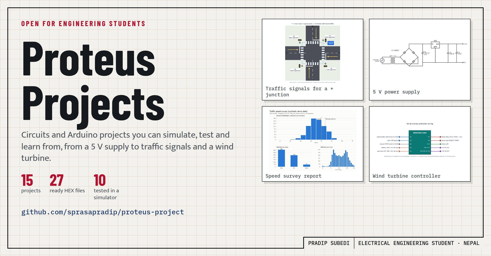

# Proteus Projects: 15 circuits and Arduino projects you can simulate and learn from

When I started with Proteus in 2023, I learned the most from projects I could open, run and break. Most tutorials show the finished circuit and stop there. I wanted something that also explains why a resistor is that value, what happens when a sensor fails, and how the code handles the cases nobody thinks about at first.

So I rebuilt my Proteus Projects repository. It now has 15 projects, from a basic 5 V power supply to a traffic controller for a 4-way junction and a wind turbine controller, and it's free to explore on GitHub:

**https://github.com/sprasapradip/proteus-project**

## What's inside

**Circuits (where most people start)**

- **5 V regulated power supply**: transformer, bridge rectifier, smoothing capacitor and a 7805, plus two PCB layouts with the 3D view. The README walks through the ripple and heat calculations, and the capacitor mistakes I made in my first version.
- **Op-amp LED flasher**: an LM741 relaxation oscillator. You learn why it blinks at about 7 Hz, and what to change for a calm one-blink-per-second.
- **SCR latch**: press once and it stays on until you break the current. The version with meters shows gate current and anode current side by side.
- **8051 multiplexed 7-segment display** and an **LED matrix scoreboard** with an Arduino and MAX7219 modules.

**Arduino projects (built around life in Nepal)**

- **Traffic light controller** for a "+" junction, with pedestrian crossing, night flashing, an emergency all-red and a conflict monitor that never lets two crossing roads get green together.
- **Water tank level controller** that protects the pump from a dry sump, a broken pipe and short cycling.
- **Gas and smoke detector** that waits for the sensor to warm up, ignores short spikes, runs the exhaust fan, closes the gas valve and sends an SMS.
- **Smart street light** that dims at night and goes to full brightness when someone passes.
- **DC power and energy meter** for solar and battery systems, with over-voltage, over-current and low-battery cut-off.
- **Wind turbine controller** that never leaves the turbine without a load, and brakes in a storm.
- **Wind vane and yaw control** that turns the turbine into the wind without twisting the cable.
- **Smart parking**, an **automatic railway level crossing** and a **vehicle speed detector** with tailgating detection, traffic statistics and a live demo for Kathmandu, Pokhara, Chitwan and Hetauda.

## How each project is organised

Every Arduino project has the same parts, so once you know one you can find your way around all of them:

- the **source code**, commented so you can follow what each part does
- a ready **HEX file** to load into the Arduino in Proteus (and a faster demo version where waiting 5 minutes would be boring)
- a **wiring diagram** and a **README** with the parts list, the build steps for Proteus and notes for real installation
- an **automatic simulator test** for most projects. The real firmware runs in an AVR simulator while the test presses buttons, changes sensor voltages and checks the outputs.

Those tests turned out to be one of the most useful parts. While building the projects they caught real bugs: a gas alarm that could trigger instantly, a yaw controller that stopped the turbine 10 degrees short of the wind, and a level crossing that counted one long train as an extra train. Each of them is explained in the project's README, and I learned more from those bugs than from the parts that worked the first time.

## How to use it as a student

1. Pick a project that matches what you're studying this semester.
2. Open it in Proteus (8.13 or newer), or build the circuit from the wiring diagram. It takes about 10 minutes.
3. Run it. Then change something: a resistor, a threshold, a timing value. Predict what will happen before you press Run.
4. Read the README section that explains the design. Check your prediction against it.

If something doesn't work or isn't clear, open an issue on GitHub. That helps the next student too.

## A note on using the code

The repository is public so anyone can read it and learn from it. The code and designs are still my own work, though, so if you want to reuse a project in your own product, report or installation, ask me first. I'm usually happy to say yes.

## What's next

I'm going to finish the Proteus files for the newest projects and add more power and energy projects. Ideas and feedback are welcome, on GitHub or LinkedIn.

*Pradip Subedi, electrical engineering student, Nepal*
