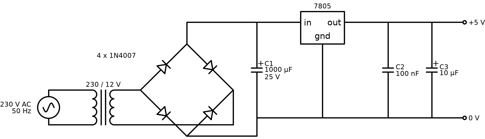

# 5 V regulated power supply

A linear 230 V AC to 5 V DC supply. It has a step-down transformer, a bridge rectifier made from four 1N4007 diodes, a reservoir capacitor and a 7805 regulator. I drew it three times while learning Proteus, so this folder has the simulation version and two PCB versions with the 3D view.

## Files

| File | What it is |
|---|---|
| `proteus/psu-simulation.pdsprj` | Schematic only, with instruments for simulation |
| `proteus/psu-pcb-3d.pdsprj` | Same circuit plus PCB layout and 3D view |
| `proteus/psu-pcb-rev2.pdsprj` | Second PCB attempt, with a different capacitor value |

## Fix this before building it

When I checked the 2023 files, I found two value mistakes:

- The big polarized capacitor after the bridge is set to **1 nF**. That does almost nothing at 100 Hz. The 7805 would see raw pulsing DC and drop out on every half cycle. It should be **1000 µF / 25 V** (or 2200 µF for 1 A, see below).
- The small capacitors are **1.5 pF** (and 0.015 µF in rev2). The 7805 datasheet asks for about 0.33 µF on the input and 0.1 µF on the output, right at the pins. Use **100 nF** ceramics.

To change a value in Proteus, double-click the part, set **Capacitance** (for example `1000u` or `100n`) and save. I can't edit the `.pdsprj` files from Linux, so these fixes still need doing in Proteus. The schematic above already shows the corrected values.

## Numbers

With a 12 V RMS secondary:

- Peak after the bridge: 12 × 1.414 − 2 × 0.7 ≈ **15.6 V**
- Ripple at load current I: ΔV ≈ I / (2 × 50 Hz × C)
  - 0.5 A with 1000 µF: ΔV ≈ 5 V, so the valley is about 10.6 V. That's fine, because the 7805 needs about 7 V in.
  - 1 A with 1000 µF: ΔV ≈ 10 V, so the valley is about 5.6 V and the output drops out. Use 2200 µF for 1 A (ΔV ≈ 4.5 V).
- 7805 heat at 0.5 A: (15.6 − 5) × 0.5 ≈ **5 W**. That needs a real heatsink. A TO-220 on its own will go into thermal shutdown.

If you need more than about 300 mA, a buck converter module (LM2596 or MP1584) runs cold and wastes far less power. I kept the linear design here because it's the classic first PSU and it simulates well.

## Running it in Proteus

1. Open `proteus/psu-simulation.pdsprj`.
2. Fix the capacitor values as described above.
3. Run the simulation. Put the oscilloscope on the bridge output and the 5 V rail to see the ripple, and how the regulator removes it.
4. For the PCB, open `psu-pcb-3d.pdsprj`, go to the PCB Layout tab, then 3D Visualizer.

## Safety

The primary side carries mains voltage. Use a fused IEC inlet (500 mA slow-blow), insulate the transformer primary, earth any metal enclosure, and never probe the primary with a normal oscilloscope ground clip.
