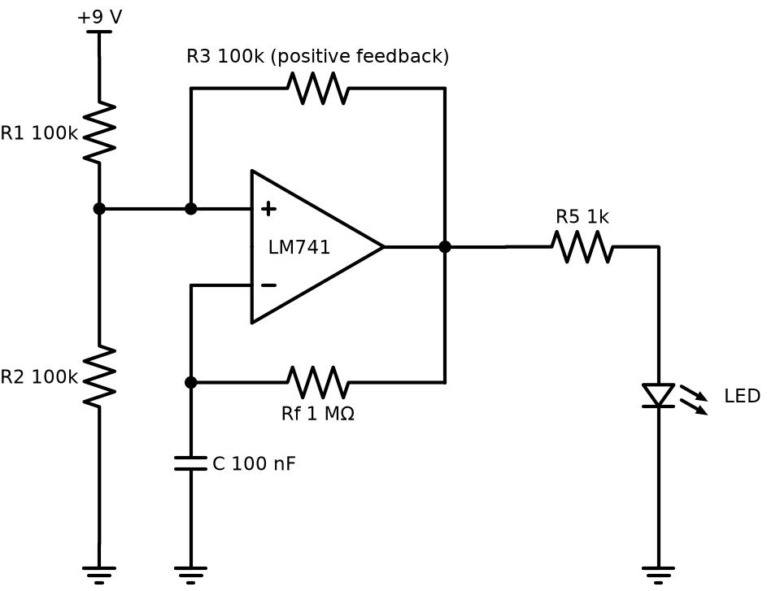

# Op-amp LED flasher

An LM741 wired as a relaxation oscillator (astable multivibrator), running from a single 9 V battery and flashing an LED. The project includes the PCB layout with a 2-pin terminal block for the battery.

## Files

| File | What it is |
|---|---|
| `proteus/led-flasher-pcb.pdsprj` | Schematic, simulation and PCB layout |

## How it works

R1 and R2 (100k each) hold the + input at half the supply. R3 (100k) feeds some of the output back into that same node. When the output is high, the + input sits at about 2/3 of the supply. When the output is low, it sits at about 1/3. That's the hysteresis.

The capacitor charges and discharges through Rf (1 MΩ). Each time its voltage crosses the threshold, the output flips.

Period, with an ideal rail-to-rail op-amp:

T = 2 × Rf × C × ln 2 = 2 × 1 MΩ × 100 nF × 0.693 ≈ **0.14 s, about 7 Hz**

That's fast enough that the LED looks like a flicker more than a blink. For a calm one-blink-per-second flash, change C to **1 µF** (about 0.7 Hz).

## Notes from checking the design

- The LM741 wants at least ±5 V (10 V total) and can't swing its output close to the rails. On 9 V it works, but the thresholds move and the frequency will be off from the formula. An **LM358** is built for single-supply use and is a drop-in improvement for the same circuit.
- With R5 = 1k and about 7 V of output swing, the LED gets about 5 mA. That's bright enough and easy on the battery.
- Real-world current is around 6 to 8 mA, so a 9 V PP3 battery (about 500 mAh) lasts roughly 3 days of continuous flashing.

## Running it in Proteus

1. Open `proteus/led-flasher-pcb.pdsprj` and run it. The LED model is animated, so you can watch it blink.
2. Put the oscilloscope on the capacitor and the op-amp output. You get a triangle-ish wave between 1/3 and 2/3 of the supply, and a square wave at the output.
3. PCB Layout tab, then 3D Visualizer, to see the board.
