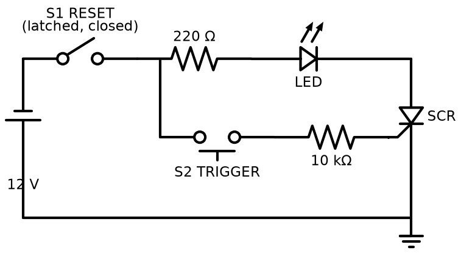

# SCR latch (switching) circuit

A thyristor (SCR) latch. A short press on the trigger button turns the SCR on, and it stays on after you let go. The only way to turn it off is to break the anode current with the reset switch. That's the idea behind crowbar protection, simple alarms and "press once to start" circuits.

## Files

| File | What it is |
|---|---|
| `proteus/scr-latch.pdsprj` | Basic latch with LEDs, switches and a PCB layout |
| `proteus/scr-latch-with-meters.pdsprj` | Same circuit with DC voltmeters and ammeters to watch the currents |

## How it works

1. With the SCR off, no current flows through the load LED.
2. Pressing S2 sends a small gate current through the 10k resistor: (12 − 0.7) / 10k ≈ 1.1 mA. That's well above the 200 µA gate trigger current of the sensitive SCR used in the design.
3. The SCR switches on and the LED lights. The load current, about (12 − 2 − 1) / 220 ≈ 40 mA, is far above the SCR's holding current, so it stays on after S2 is released.
4. Opening S1 drops the anode current to zero, so the SCR turns off. Closing S1 again leaves it off until the next trigger.

The meters version makes this easy to see. Gate current only flows while the button is held, but anode current keeps flowing afterwards.

## Notes

- 40 mA is high for a standard 5 mm LED (most are rated 20 mA). Change 220 Ω to **470 Ω** for about 19 mA.
- An SCR on DC can't turn itself off, so that's not a bug. It's the reason SCRs are used for latching. On AC it turns off at every zero crossing.

## Running it in Proteus

Open either file and run it. Click the push button: the LED latches on. Click the reset switch: it goes off.
