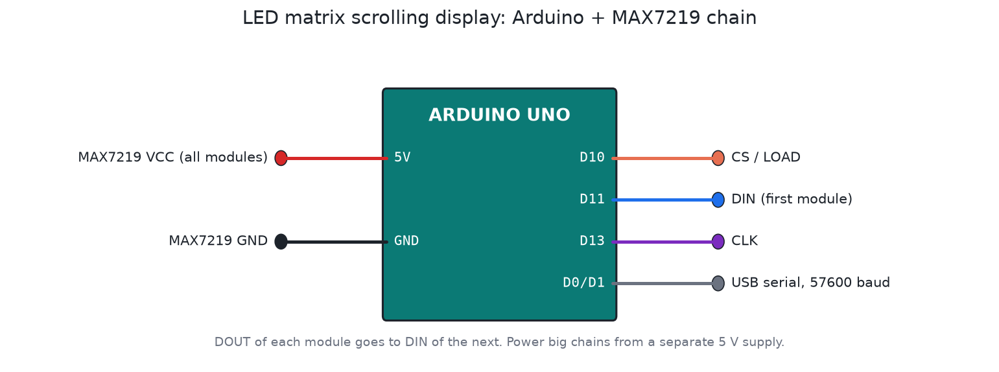

# LED matrix scrolling display (scoreboard)

An Arduino Uno driving a chain of MAX7219 8×8 LED matrix modules with the MD_Parola library. Text scrolls across the display, and you can type a new message in the serial terminal.



## Files

| File | What it is |
|---|---|
| `firmware/Parola_Scrolling/Parola_Scrolling.ino` | Arduino sketch |
| `firmware/build/Parola_Scrolling.hex` | Compiled firmware |
| `proteus/scrolling-display.pdsprj` | Final design: Arduino, MAX7219 chain, red and green matrices, virtual terminal |
| `proteus/Arduino_Code.ino.hex` | Same HEX, under the exact name the Proteus file looks for |
| `proteus/scrolling-display-basic.pdsprj` | Earlier, smaller version |

## What I fixed

The 2023 Proteus files pointed at HEX files in a temporary build folder on my old laptop (`C:\Users\subed\AppData\Local\Temp\arduino_build_...`). On any other PC, or after a reboot, the simulation had no program.

The final design looks for `Arduino_Code.ino.hex` next to the project file. That file now exists and is rebuilt by `tools/build_all.sh`, so the project runs as soon as you open it.

The libraries are pinned (MD_Parola v3.7.7, MD_MAX72XX v3.5.1), so the HEX can be rebuilt the same way later.

## Running it in Proteus

1. Open `proteus/scrolling-display.pdsprj` and run it. "Welcome its me pradip" scrolls across the matrices.
2. Type a message in the virtual terminal (57600 baud) and press Enter. It replaces the text after the current pass.
3. For the basic version, double-click the Arduino and set **Program File** to `../firmware/build/Parola_Scrolling.hex`.

If the text looks mirrored or scrambled, the module type is wrong. Change `HARDWARE_TYPE` in the sketch (FC16_HW, PAROLA_HW or GENERIC_HW) and rebuild. `MAX_DEVICES` should equal the number of 8×8 modules in the chain.

## Real hardware

- Each 8×8 module can draw up to about 300 mA at full brightness. More than four modules need their own 5 V supply, not the Uno's regulator.
- Put a 100 µF capacitor across the 5 V rail at the start of the chain, and a 10 µF one at every fourth module.
- Long chains need short, thick power wires. Thin jumper wires are the usual cause of flicker at the far end.

## Rebuilding

```bash
tools/build_all.sh       # rebuilds every project, including this one
```
