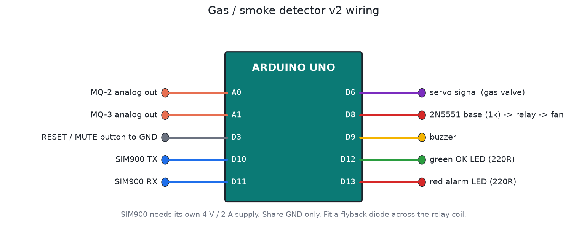

# Gas / smoke detector with SMS alert (v2)

An Arduino Uno watching an MQ-2 (LPG and smoke) and an MQ-3 (alcohol and vapour). On a confirmed leak it sounds the buzzer, starts the exhaust fan, closes the gas valve with a servo, and sends an SMS through a SIM900 module.



## Files

| File | What it is |
|---|---|
| `firmware/gas_detector/gas_detector.ino` | v2 firmware |
| `firmware/build/gas_detector.hex` | Real-time build, SMS disabled until you add a number |
| `firmware/build/gas_detector_sim_x10.hex` | 10x faster timers and a dummy number (+9779800000000) for Proteus demos |
| `proteus/gas-smoke-detector.pdsprj` | Arduino, MQ-2, MQ-3, SIM900D, relay + fan, servo, buzzer |
| `proteus/library/` | The Engineering Projects gas sensor library used by the schematic |
| `test/sim_test.c` | Automatic bench test (simavr) |

## Why v2

v1 (`smoke.ino`, 2023) checked one sensor once a second and beeped. That's a fair start, but in real use it gives false alarms at power-on, chatters when the reading sits near the threshold, and does nothing about the gas. The Proteus file was also pointing at another person's HEX in their temp folder (`C:\Users\zain\...`), so it never ran this project's code.

v2 changes:

- Sensors get 60 s to warm up before any alarm can fire.
- Readings are averaged over 16 samples and must stay high for 2 s. A single spike is ignored.
- The alarm switches on and off at different levels (hysteresis), so a reading near the threshold doesn't flip it back and forth.
- A WARNING level gives a short beep before the full alarm.
- The fan keeps running for 60 s after the gas clears, to purge the room.
- The gas valve closes on alarm and stays closed until a person presses RESET with clean air. It never reopens by itself.
- SMS goes to up to two numbers, one per event, with a reminder every 10 minutes while the alarm continues. Sending doesn't block, so the alarm keeps working while the SMS goes out.
- A sensor reading stuck at 0 or 1023 for 5 s is reported as SENSOR FAULT, not ignored and not treated as gas.
- The RESET button mutes the buzzer during an alarm (the fan and valve stay active). There's also a 4 s watchdog.

## Pins

| Pin | Use |
|---|---|
| A0 / A1 | MQ-2 / MQ-3 analog outputs |
| D3 | RESET / MUTE button to GND |
| D6 | Servo signal (gas valve) |
| D8 | Relay driver (2N5551 + flyback diode), relay switches the fan |
| D9 | Buzzer |
| D10 / D11 | SoftwareSerial RX / TX to SIM900 TX / RX |
| D12 / D13 | Green OK LED / red alarm LED |

## Setting it up

Edit the top of the sketch:

```cpp
#define ALERT_PHONE_1 "+97798XXXXXXXX"
#define ALERT_PHONE_2 ""             // optional
#define SITE_NAME "Kitchen"
```

To calibrate, power it in clean air for a day and watch the serial log (9600 baud). Set the WARN level to about 1.5 times the clean-air reading and ALARM to about 2 times. MQ sensors also need a 24 to 48 hour burn-in when they're brand new.

## Running it in Proteus

1. Copy `proteus/library/GasSensorsTEP.LIB` and `.IDX` into Proteus's `LIBRARY` folder and restart Proteus.
2. Open `proteus/gas-smoke-detector.pdsprj`.
3. Each gas sensor's Program File should point to `proteus/library/GasSensorTEP.HEX`.
4. Set the Arduino's Program File to `firmware/build/gas_detector_sim_x10.hex`.
5. Check the schematic wiring against the pin table above and move any wires that differ. The 2023 schematic was wired for code that's no longer used.
6. Run it. Raise the sensor's test input and watch the log in the virtual terminal: WARMUP, NORMAL, WARNING, ALARM, then PURGE once you lower it again.

## Testing

```bash
tools/test_all.sh      # runs this test with all the others
```

The test runs the compiled firmware in simavr. It covers warm-up, warning, spike rejection, alarm confirmation, fan and valve, SMS queueing, mute, purge, manual reset and an unplugged sensor. Writing it caught a real timing bug in my first draft: confirmation could fire instantly on even milliseconds. That's fixed.

## Safety note

This is a learning and demo project. For a real kitchen or LPG store, use a certified gas detector as the primary device. This board makes a useful second layer (SMS, fan, valve), but it isn't a replacement.
