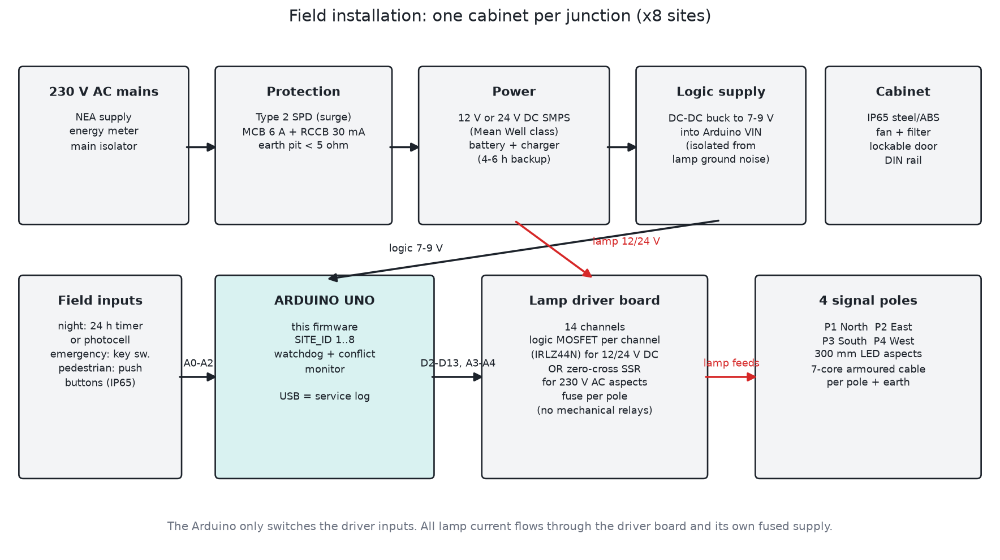

# Field installation: one "+" junction, 4 signal poles

This is how I plan to install each of the 8 sites. Each junction gets one controller cabinet and four poles, one per corner. Because the hardware is the same at every site, a spare cabinet can replace any of them. You only reflash it with the right `SITE_ID`.

Before any digging starts, get the phase plan, the timings and the pole positions signed off by the traffic police and the road owner (Department of Roads, or the municipality for city roads). The numbers in the firmware are my starting values. They aren't approved values.


## 1. Where the 4 poles go

We drive on the left, so a driver coming into the junction looks to the left side of their own lane. Put each pole on the near left corner of the approach it controls, just behind the stop line:

| Pole | Corner | Controls traffic coming from | Head faces |
|---|---|---|---|
| P1 | North-East | North (driving south) | North |
| P2 | South-East | East (driving west) | East |
| P3 | South-West | South (driving north) | South |
| P4 | North-West | West (driving east) | West |

Practical points:

- Stop line first, then zebra crossing, then the junction. The pole goes about 1 m behind the stop line and 0.6 m or more back from the kerb edge, so buses and trucks don't hit it with their mirrors.
- The lowest lamp should sit about 2.5 to 3 m above the footpath. Turn the head so a driver at the stop line sees it straight on.
- If a road is wide (2 lanes or more each way) or there's a bus stop that blocks the view, add a repeater head on the far side of the junction. It's wired in parallel with the main head, so it takes no extra controller output.
- Mount the pedestrian heads (WALK / DON'T WALK) on the same poles, facing across the zebra. All four are wired in parallel to A3/A4 through the driver board, and the push buttons on all four poles are wired in parallel to A2.

## 2. Cabinet

- Put it on one corner (I use the P1 corner) on a concrete plinth about 300 mm high, so monsoon water doesn't get in.
- Use an IP65 steel or thick ABS enclosure with a lockable door, a filtered vent or small fan, and a DIN rail inside.
- Lay a 100 mm HDPE duct under the road from the cabinet to each pole, with a draw pit at each pole base. One duct crossing per road arm is enough if you lay it as a ring like in the picture.



## 3. Power and protection

| Item | What I use | Why |
|---|---|---|
| Supply | 230 V AC from the NEA line through its own energy meter | the meter keeps the electricity bill separate |
| Surge | Type 2 SPD on the incoming line | lightning and switching surges on long overhead lines are normal here |
| Breakers | MCB 6 A plus RCCB 30 mA | people touch the poles, so you need earth leakage protection |
| Earth | earth pit at the cabinet, under 5 ohm, and every pole bonded to it | metal poles must never become live |
| Lamp supply | 12 V or 24 V DC SMPS from a known brand, sized at 1.5x the total lamp load | LED aspects work better on DC, and it's safer for maintenance |
| Backup | sealed lead-acid or LiFePO4 battery with a charger, 4 to 6 hours | load shedding should not black out the junction |
| Logic supply | separate DC-DC buck to 7 to 9 V into the Arduino VIN | keeps lamp switching noise away from the micro |

Load estimate: a 300 mm LED aspect draws about 10 to 15 W. At most 4 lamps are on at any moment, plus 2 pedestrian lamps (more if you add repeaters). A 12 V 10 A supply covers one junction with margin.

## 4. The lamp driver board (important)

The Arduino pins can only give about 20 mA, and the lamps need around 1 A each. Never connect a real lamp to the Arduino. Every output goes through one driver channel:

- 12 or 24 V DC LED aspects (recommended): use one logic-level N-MOSFET (IRLZ44N or similar) per channel, with a 100 R gate resistor and a 10 k pull-down. Fit a TVS diode on each outgoing cable, because long cables pick up surges. Keep `OUTPUT_ACTIVE_HIGH 1`.
- 230 V AC aspects: use a zero-cross solid-state relay per channel, rated at least 2 A, with an RC snubber and a MOV. Set `OUTPUT_ACTIVE_HIGH` to match the SSR input.
- Don't use the cheap blue mechanical relay boards in the field. Each channel switches hundreds of times a day, and those relays wear out in months. They're fine on the bench.

You need 14 channels: 12 for vehicle heads and 2 for pedestrian lamps. Put a fuse on each pole's feed so one damaged pole doesn't take down the whole junction.

The 10 k pull-downs matter for safety. If the Arduino dies or loses power, every MOSFET turns off and the junction goes dark instead of showing a random pattern. Drivers will treat a dark junction as unsignalled, which is safer than a wrong green.

## 5. Cabling to the poles

- Run 7-core armoured cable (1.5 mm²) from the cabinet to each pole: red, yellow, green, WALK, DON'T WALK, common return, and earth. That leaves the push button pair, which can go in a separate 2-core cable.
- Label both ends of every core with the pole number and the colour (for example `P2-Y`). The person who fixes it at 11 pm in the rain will thank you.
- Use terminal blocks in the cabinet laid out in the same order as the pin table. That makes fault-finding easy with a multimeter.

## 6. Inputs in the field

| Input | Field device | Notes |
|---|---|---|
| A0 night | 24 h digital timer contact, or a photocell relay | set it to the hours the traffic police agree on, for example 23:00 to 05:00 |
| A1 emergency | key switch inside the cabinet, and optionally a second one in a police box | wire them in parallel. Either one holds all-red |
| A2 pedestrian | IP65 push buttons on all 4 poles in parallel | use shielded cable on long runs |

All inputs are active low with the internal pull-up. Add a 100 nF capacitor from each input to GND at the terminal block to filter noise on long cables.

## 7. Flashing each site

1. Open the sketch and set `#define SITE_ID n` (1 to 8). Alternatively, flash the ready file `firmware/build/traffic_controller_site0n.hex` with avrdude:

   ```bash
   avrdude -p m328p -c arduino -P /dev/ttyUSB0 -b 115200 \
     -U flash:w:traffic_controller_site03.hex:i
   ```

2. Open a serial monitor at 9600. The first lines must show the correct site:

   ```
   [S03 SITE-03 t=0s] Traffic controller v2.0.0 boot, reset=POWER-ON
   [S03 SITE-03 t=0s] 4 phases, plan=SPLIT
   ```

3. Write the site number on a label on the Arduino and on the cabinet door.

## 8. Commissioning at the junction

Do this with traffic police present and the heads covered or turned away until step 6.

1. Power on with the lamp supply switched off and check the serial log: it should show the right site and `POWER-ON`.
2. Switch the lamp supply on. Walk to each pole and check that red is lit on all four.
3. Watch one full cycle. Each pole should go green in turn, N, E, S, W, and the green on a pole should match its approach (P1 = traffic from the north).
4. Press a pedestrian button and check WALK on all four poles.
5. Test night and emergency. Then pull one lamp wire at the driver output and confirm the rest keep working. (The firmware can't detect a blown lamp yet. That needs current sensing, which is on the list below.)
6. Uncover the heads, watch at least 3 cycles in real traffic, and adjust greens if queues build up on one arm.
7. Fill in the row for this site in `SITE_REGISTER.md`.

## 9. What I'd add for the next revision

These are the gaps I know about. None of them stops the first installation, but a government junction should get them eventually.

- An independent hardware conflict monitor: a small second circuit that watches the lamp outputs and cuts the lamp supply if two crossing greens are ever on together. Right now that check runs in the same chip it's checking.
- Lamp current sensing, so a blown red lamp gets reported.
- An RTC (DS3231 on A4/A5) for time-of-day plans: longer greens at office hours and automatic night mode without a separate timer.
- A GSM or LoRa module for remote fault alerts across all 8 sites.
- Moving from an Arduino Uno board to the same ATmega328P on a custom PCB with conformal coating and screw terminals. The code stays the same.
