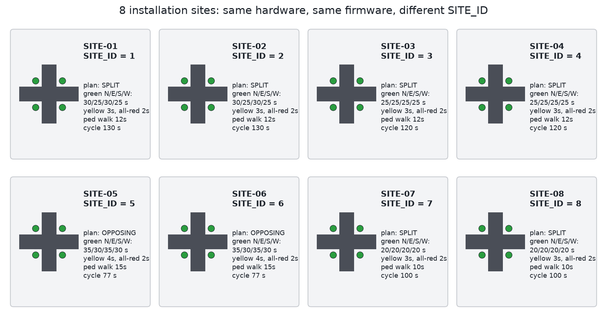

# Site register

One row per junction. Fill in the location details when the survey is done, and keep this file in sync with the `SITES` table in the firmware. If a box gets swapped, check its `SITE_ID` here before you flash the spare.

## Firmware settings (current values in the code)

| SITE_ID | Name in code | Plan | Green N / E / S / W (s) | Yellow | All-red | Ped walk + flash | Cycle |
|---|---|---|---|---|---|---|---|
| 1 | SITE-01 | SPLIT | 30 / 25 / 30 / 25 | 3 | 2 | 12 + 6 | 130 s |
| 2 | SITE-02 | SPLIT | 30 / 25 / 30 / 25 | 3 | 2 | 12 + 6 | 130 s |
| 3 | SITE-03 | SPLIT | 25 / 25 / 25 / 25 | 3 | 2 | 12 + 6 | 120 s |
| 4 | SITE-04 | SPLIT | 25 / 25 / 25 / 25 | 3 | 2 | 12 + 6 | 120 s |
| 5 | SITE-05 | OPPOSING | 35 / 30 / 35 / 30 | 4 | 2 | 15 + 6 | 77 s |
| 6 | SITE-06 | OPPOSING | 35 / 30 / 35 / 30 | 4 | 2 | 15 + 6 | 77 s |
| 7 | SITE-07 | SPLIT | 20 / 20 / 20 / 20 | 3 | 2 | 10 + 5 | 100 s |
| 8 | SITE-08 | SPLIT | 20 / 20 / 20 / 20 | 3 | 2 | 10 + 5 | 100 s |

The cycle times above leave out the pedestrian phase. When someone presses the button, that cycle gets longer by walk + flash + all-red.

When you rename a site, keep the name short (up to 12 characters), because it gets printed at the start of every log line.

## Location and installation record

| SITE_ID | Junction name / chowk | Ward, municipality | GPS | North arm road name | Cabinet corner | Installed on | Installed by | Notes |
|---|---|---|---|---|---|---|---|---|
| 1 | | | | | | | | |
| 2 | | | | | | | | |
| 3 | | | | | | | | |
| 4 | | | | | | | | |
| 5 | | | | | | | | |
| 6 | | | | | | | | |
| 7 | | | | | | | | |
| 8 | | | | | | | | |

"North arm" means whichever road you wired as North (D2 to D4). It doesn't have to be true north. Just write down which road it is so the next technician isn't guessing.

## Maintenance log

| Date | SITE_ID | What happened | What was done | By |
|---|---|---|---|---|
| | | | | |
