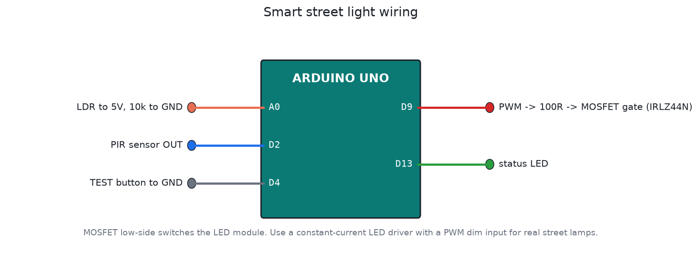

# Smart street light

A street light that's off in the day and dims itself at night. It only goes to full brightness when the PIR sensor sees someone on the road. On a quiet lane most of the night is spent at 20 to 40 %, so it uses much less energy than a lamp left at 100 %, and the LEDs last longer too.

## Behaviour

| Time | Brightness |
|---|---|
| Day | Off. Motion is ignored. |
| First 4 hours after dusk | 40 % |
| Late night | 20 % |
| Motion detected | 100 % for 60 s after the last movement, then a slow 3 s fade back |
| TEST button | 100 % for 30 s, day or night, for maintenance checks |

Day and night come from an LDR, with two filters so the lamp doesn't flicker on and off:

- Hysteresis: the lamp turns on below 300 ADC counts, but only turns off above 450.
- Confirmation time: it has to stay dark for 30 s before the lamp turns on (a passing cloud won't do it), and stay light for 60 s before it turns off (a car's headlights won't do it).

Brightness is mapped through a squared curve, so 20 % actually looks like 20 % to the eye.

## Files

| File | What it is |
|---|---|
| `firmware/smart_street_light/smart_street_light.ino` | Firmware |
| `firmware/build/smart_street_light.hex` | Real-time build |
| `firmware/build/smart_street_light_sim_x10.hex` | Timers 10x faster, for Proteus |
| `test/sim_test.c` | Automatic bench test (simavr) |

## Building it in Proteus

1. Add `ARDUINO UNO`, `TORCH_LDR` (or `LDR`) with a 10k `RES` to GND, `BUTTON`, `IRLZ44N` (or `IRF540`), a `LAMP` or LED string with a 12 V `BATTERY`, and a `LOGICSTATE` to stand in for the PIR output.
2. Wire it as in `images/wiring.png`. The LDR goes from +5 V to A0, and the 10k from A0 to GND. D9 drives the MOSFET gate through 100 Ω, with 10k from gate to GND. The lamp sits between +12 V and the drain, and the source goes to GND.
3. Set the Arduino's Program File to `firmware/build/smart_street_light_sim_x10.hex` and run it.
4. Shine the torch on the LDR for day, remove it for night. Toggle the LOGICSTATE to fake motion.

Save it as `proteus/smart-street-light.pdsprj` and commit it.

## Real lamps

Use a constant-current LED driver with a PWM or 0-10 V dim input. Don't switch an LED module directly with a MOSFET at mains level. The Arduino PWM (490 Hz on D9) can drive the driver's dim input through an optocoupler. Fit the PIR in a hood so it only sees the road, not swaying trees.

## Testing

The test covers the day, ignoring motion and short shadows, dusk at 40 %, headlights at night, motion to 100 % with hold and fade, the late-night 20 % level, dawn confirmation and the TEST button.
