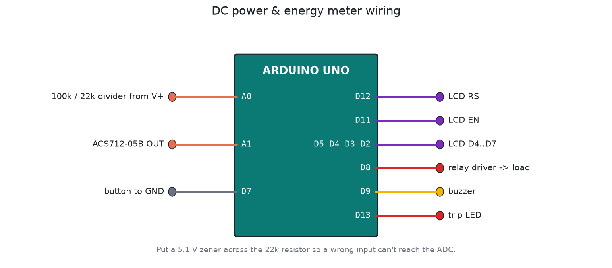

# DC power and energy meter with protection

For solar panels, batteries and DC supplies. It shows volts, amps, watts and watt-hours on a 16x2 LCD and logs CSV over USB. It also switches the load off on over-voltage, over-current, a short circuit or a flat battery.



## Specs

| | |
|---|---|
| Voltage | 0 to 27.7 V, using a 100k / 22k divider into A0 |
| Current | ±5 A, using an ACS712-05B into A1 (185 mV/A). Swap in the 20 A or 30 A version by changing one constant. |
| Readings | 5 per second, each the average of 64 ADC samples |
| Current zero | Measured automatically at power-on while the load is still disconnected |
| Energy | Integrated every reading. Saved to EEPROM every 10 min across 16 rotating slots, which makes the EEPROM last decades instead of about a year |

Protection (the relay on D8 connects the load):

| Condition | Action |
|---|---|
| > 26.0 V for 0.5 s | Trip, latched |
| > 4.5 A for 0.2 s | Trip, latched |
| ACS712 at full scale (dead short) | Trip immediately, latched |
| < 10.5 V for 3 s (flat 12 V battery) | Disconnect, then reconnect by itself after 10 s above 12.0 V |

A short press on the button clears a latched trip, but only once the cause has gone. Holding it for 3 s clears the energy counter.

The load is never connected at power-on until the first reading shows a sane voltage.

## CSV log

At 9600 baud it prints a header, then one line per second, ready for Excel or Python:

```
DATA,seconds,volts,amps,watts,watt_hours,state
DATA,12,12.01,2.008,24.11,0.063,ON
```

## Files

| File | What it is |
|---|---|
| `firmware/dc_power_meter/dc_power_meter.ino` | Firmware |
| `firmware/build/dc_power_meter.hex` | Build (real time, no scaling needed) |
| `test/sim_test.c` | Automatic bench test (simavr) |

## Building it in Proteus

1. Add `ARDUINO UNO`, `LM016L`, `RES` 100k and 22k, `POT-HG` (to stand in for the ACS712 output), `RELAY` + NPN driver + diode, `BUTTON`, `BUZZER`, `LED-RED`, and a `BATTERY` or variable DC source for the input.
2. LCD wiring is the classic Arduino example: RS = D12, E = D11, D4 to D7 = D5, D4, D3, D2.
3. Divider: input + to 100k, 100k to A0, A0 through 22k to GND.
4. Current: put the POT-HG wiper on A1, between 0 and 5 V. 2.5 V means 0 A, and each extra 185 mV means 1 A. Leave it at 2.5 V while the simulation starts, because that's when the meter learns its zero.
5. Set the Arduino's Program File to `firmware/build/dc_power_meter.hex`, then run it and play with the input voltage and the pot.

Save it as `proteus/dc-power-meter.pdsprj` and commit it.

## Calibration

Measure the Uno's 5 V pin with a good multimeter and put the value in `VREF`. Measure the two divider resistors and update `DIVIDER_RATIO`. That's usually enough for ±1 % on voltage. For current, compare against a clamp meter at about 2 A and adjust `ACS_MV_PER_A` if needed.

## Safety

- Put a 5.1 V zener (with a 1k series resistor) on A0, so a wrong connection can't kill the ADC.
- The ACS712 is isolated, but its PCB tracks aren't rated for mains. This meter is for low-voltage DC only.
- Fuse the load path to match the relay and the wiring.

## Testing

The test checks the 12.0 V / 2.00 A / 24 W readings and the Wh integration, plus over-current (with the short-overload grace time), the latch and reset, short circuit, over-voltage with a refused reset, low-voltage disconnect with hysteresis and auto-reconnect, and clearing the energy counter.
