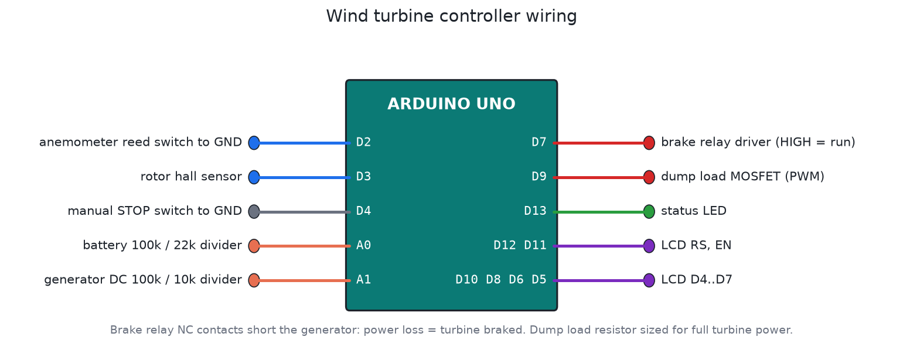

# Wind turbine controller

I wanted to build a wind turbine project back in college and never finished it. This is that project done properly. It's a controller for a small 300 W to 1 kW turbine charging a 12 V battery bank, like the ones that make sense on windy ridges in the hills, where the grid is weak or doesn't reach.



## The one rule of wind turbines

A wind turbine must never run without a load. A solar panel with a full battery just sits there. A turbine with its load disconnected speeds up until the blades or the bearings fail. So this controller never disconnects the turbine. When the battery is full, it moves the surplus power into a dump load (a heater resistor or a water heater element) using PWM.

## What it does

| Measures | How |
|---|---|
| Wind speed | Cup anemometer reed switch on D2 (1 pulse per second = 0.667 m/s) |
| Rotor speed | Hall sensor and magnet on the shaft, D3, 1 pulse per revolution |
| Battery voltage | 100k / 22k divider on A0 |
| Generator voltage | 100k / 10k divider on A1 (after the rectifier) |

| Situation | Action |
|---|---|
| Battery between 14.4 and 14.8 V | Dump load PWM rises from 0 to 100 %, ramping about 10 % per second so the generator load never jumps |
| Rotor above 600 rpm for 2 s | Brake |
| Wind above 25 m/s for 5 s | Brake (storm) |
| Battery above 15.2 V for 10 s | Brake. The dump load can't keep up, or it has failed |
| STOP switch on | Brake at once, for maintenance |
| After a brake | Released only after 5 minutes of wind under 15 m/s and the rotor under 30 rpm |

The brake is fail-safe. The relay's normally-closed contacts short the generator phases (through brake resistors on bigger machines), and the Arduino has to hold the relay on (D7 HIGH) for the turbine to run. If the board loses power, crashes, or a wire breaks, the turbine brakes. It also starts braked at power-on.

The LCD shows wind, rpm, battery voltage and dump load (or the brake reason). Over USB it logs a CSV line every second:

```
DATA,seconds,wind_ms,rpm,batt_v,gen_v,dump_pct,state
DATA,42,7.3,312,13.62,18.4,0,RUN
```

## Files

| File | What it is |
|---|---|
| `firmware/wind_turbine_controller/wind_turbine_controller.ino` | Firmware |
| `firmware/build/wind_turbine_controller.hex` | Real-time build |
| `firmware/build/wind_turbine_controller_sim_x10.hex` | 5-minute brake release shortened to 30 s, for Proteus |
| `test/sim_test.c` | Simulator test |

## Building it in Proteus

1. Add `ARDUINO UNO`, `LM016L`, `RELAY` + NPN driver + diode, `IRLZ44N` + a power `RES` as the dump load, `SW-SPST` for STOP, and two `POT-HG` to stand in for the battery and generator dividers.
2. For the anemometer and hall sensor, use `CLOCK` generators on D2 and D3. 11 Hz on D2 is about 7.3 m/s. 5 Hz on D3 is 300 rpm.
3. Wire it as in `images/wiring.png`. Set the Arduino's Program File to `firmware/build/wind_turbine_controller_sim_x10.hex`.
4. Run it. Turn the battery pot towards 14.6 V to see the dump load come in, then raise the D2 clock above 38 Hz (25 m/s) to see the storm brake.

Save it as `proteus/wind-turbine-controller.pdsprj` and commit it.

## In the field

- Size the dump load for the turbine's full rated power, with margin. A 1 kW turbine needs a 1 kW (or bigger) resistor, mounted where the heat can go.
- Put a proper fuse and a DC breaker between the rectifier and the battery.
- The anemometer should be on the tower but clear of the rotor wake (at least 1 m below the blade tip, or on a side arm).
- Check the tower earthing and lightning protection. A turbine tower is usually the tallest thing around.

## Testing

`tools/test_all.sh` runs the test. It checks start-up braked, the release, the dump load ramp at 14.6 and 15.0 V, that the turbine is never disconnected, storm braking with the gust tolerance, the 5-minute calm release, over-speed, the STOP switch, and the dump-load-overwhelmed case.
