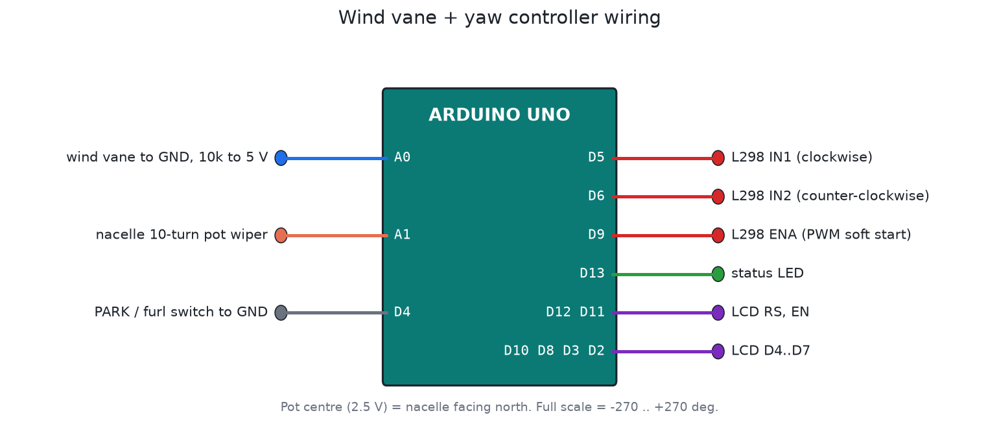

# Wind direction vane + turbine yaw control

The other half of the college wind turbine idea. It reads where the wind is coming from and turns the turbine to face it. On small turbines a tail fin does this. Bigger machines, or a turbine you want to turn out of a storm on purpose, need a motorised yaw drive, and this is its controller.

## Reading the wind direction

The vane is the common 16-position resistor type (the SparkFun / Argent weather meter vane). Each direction connects a different resistor, so with a 10k pull-up every direction gives its own voltage on A0. The firmware works out the 16 expected ADC values from the resistor list and picks the nearest. A reading far from all 16 means a broken or shorted vane, and it's ignored.

## Not chasing every gust

Wind direction swings around all the time. If the turbine followed every swing, the yaw motor would wear out in weeks. So:

- Direction is a vector average over about 30 s. Angles can't be averaged as plain numbers: 350° and 10° average to 0° (north), not 180°.
- If the wind is too changeable (the averaged vector is short), it doesn't yaw at all.
- It only starts turning when the error has stayed above 15° for 10 s, and it stops within 5° of the target.
- The motor ramps up over about 1 s (soft start on the ENABLE pin) to go easy on the gearbox.

## Cable twist protection

The power cable runs down the tower, so the nacelle can't spin round forever. Here it may turn between −270° and +270° (one and a half turns each way). For every new wind direction, the controller looks at all the equal angles (for example 300° is also −60°), keeps the ones inside the limit, and picks the closest. Sometimes that means going the long way round, which also untwists the cable. The test runs a sequence of wind changes that would wind the cable up and checks it never goes past ±270°.

## Other features

- PARK / furl switch: turns the rotor 90° out of the wind, for storms or working on the turbine.
- YAW STUCK: if the target isn't reached within 90 s (jammed gear, dead motor, broken pot), the motor stops and the fault is latched.
- LCD shows the wind direction (N, NNE, ...), the nacelle angle and the mode. A CSV log goes out over USB.

## Files

| File | What it is |
|---|---|
| `firmware/wind_vane_yaw/wind_vane_yaw.ino` | Firmware |
| `firmware/build/wind_vane_yaw.hex` | Real-time build |
| `firmware/build/wind_vane_yaw_sim_x10.hex` | Averaging and start delay 10x faster, for Proteus |
| `test/sim_test.c` | Simulator test, with a simulated nacelle that turns when the motor runs |

## Building it in Proteus

1. Add `ARDUINO UNO`, `LM016L`, `L298` (or `L293D`), `MOTOR-DC`, `SW-SPST` for PARK, and two `POT-HG`. One stands in for the vane (or use a `RES` per direction and a rotary switch), the other for the nacelle position.
2. Wire it as in `images/wiring.png`. Set the Arduino's Program File to `firmware/build/wind_vane_yaw_sim_x10.hex`.
3. Run it. Change the vane pot and watch the motor turn after the delay. Turn the nacelle pot by hand to "follow" the motor (or couple a second pot to the motor in your head), and see it stop when it's on target.

Save it as `proteus/wind-vane-yaw.pdsprj` and commit it.

## In the field

Use a 10-turn pot geared to the yaw ring, or better, an absolute magnetic encoder (AS5600 type) with a turns counter. Add limit switches at ±280° that cut the motor in hardware, as a backup for the software limit.
