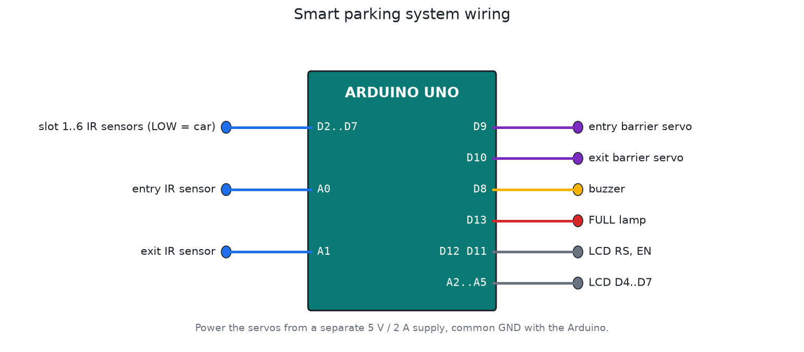

# Smart parking system

A 6-slot car park with an entry barrier, an exit barrier, and a display that always shows the real number of free spaces. It's the kind of system a municipality, hospital or shopping centre in Kathmandu could use, and it scales up by adding sensors.

## Why sensors in every slot

A lot of parking counters just count cars in and out. That drifts during the day: a motorbike squeezes past, someone reverses out the entrance, a sensor misses one. Here every slot has its own IR sensor, so the free count is the actual state of the car park, every second.

## What it does

- The LCD shows `Free 3/6` and a slot map like `1X2-3X4-5-6X` (X = taken). A FULL lamp lights when there's no space.
- The entry barrier opens only if a slot is free. When the car park is full, the driver gets a beep and "PARKING FULL", and the barrier stays down.
- The exit barrier always opens for a car leaving.
- A barrier never closes on a car. It waits until the car has fully passed, plus 2 s. If a car appears under a barrier that's coming down, it goes back up, even when the car park is full. Safety comes before the slot count.
- If a car sits at an open barrier for 20 s, the buzzer calls the attendant.
- Slot sensors are filtered for 1.5 s, so people walking past and reflections don't flicker the count.
- Barriers move slowly and smoothly (about 1 s for 90°) instead of slamming.
- Every event is logged over USB as CSV: `EVENT,seconds,event,free_slots`.

## Files

| File | What it is |
|---|---|
| `firmware/smart_parking/smart_parking.ino` | Firmware |
| `firmware/build/smart_parking.hex` | Build (no speed-up needed) |
| `test/sim_test.c` | Simulator test |

## Building it in Proteus

1. Add `ARDUINO UNO`, `LM016L`, 2 × `MOTOR-SERVO`, `BUZZER`, `LED-RED`, and 8 × `SW-SPST` or `LOGICSTATE` for the 6 slots plus the entry and exit sensors.
2. Wire it as in `images/wiring.png`. Each sensor input reads LOW when a car is there.
3. Set the Arduino's Program File to `firmware/build/smart_parking.hex` and run it. Close the entry switch to bring a car in, then close a slot switch to park it.

Save it as `proteus/smart-parking.pdsprj` and commit it.

## Scaling up

For more than 6 slots, use 74HC165 shift registers (8 slots each, 3 pins total) or one ESP32 per row reporting over Wi-Fi to a display at the gate. The barrier logic stays the same.

## Testing

The test covers both barriers down at start, the first car with the 2 s close delay, the slot sensor filter, filling all 6 slots, the FULL lamp and a refused car, a car leaving, the tailgater safety re-open when the car park has just become full, and the attendant warning.
