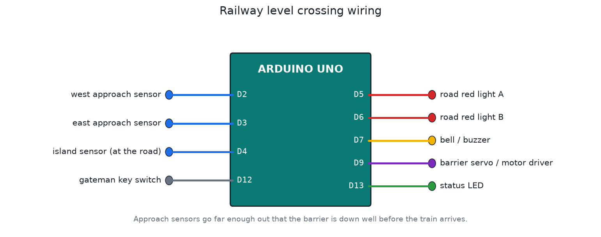

# Automatic railway level crossing

Automatic barriers where a railway crosses a road. With the Janakpur line running again, and more railway planned in Nepal, village roads will cross tracks in many places where a full-time gateman isn't practical. This controller closes the road for every train and opens it only when it's really clear.

## Sensors

- West and east approach sensors on the track, far enough out that the barrier is down well before the train reaches the road.
- An island sensor at the road itself: is a train on the crossing right now?
- A gateman key switch.

## Sequence

1. A train reaches an approach sensor. The red lights start flashing alternately and the bell rings.
2. After 6 s of warning (time for cars already on the crossing to get off), the barriers come down slowly over 6 s.
3. The train crosses the road (island sensor).
4. The train passes the sensor on the far side. 3 s later the barriers go up and the lights stop.

## The hard cases it handles

| Case | Behaviour |
|---|---|
| Train from either direction | It notes which side the train came from and waits for it at the opposite sensor |
| Two trains at once, one each way | Each train is tracked separately. The road opens only when both have passed. |
| Long train: its front reaches the far sensor while its tail is still on the road | The island sensor keeps the road closed until the tail is gone |
| Train detected but never arrives (stopped or reversed) | The road stays closed, which is the safe side. The gateman clears it with the key. |
| Gateman key on | The crossing is forced closed |
| A sensor stuck active for 10 minutes | FAULT: closed and flashing until the gateman checks it and resets with the key |
| Train on the crossing at power-up | Closes immediately |

The barriers never rise while a train is on the crossing. The test checks that every millisecond.

## Files

| File | What it is |
|---|---|
| `firmware/level_crossing/level_crossing.ino` | Firmware |
| `firmware/build/level_crossing.hex` | Real-time build |
| `firmware/build/level_crossing_sim_x10.hex` | Stuck-sensor time shortened to 60 s, for Proteus |
| `test/sim_test.c` | Simulator test |

## Building it in Proteus

1. Add `ARDUINO UNO`, `MOTOR-SERVO`, 2 × `LED-RED` with 220R, `BUZZER`, and 4 × `SW-SPST` or `BUTTON` (west, east, island, gateman key).
2. Wire it as in `images/wiring.png`. Set the Arduino's Program File to `firmware/build/level_crossing_sim_x10.hex`.
3. Run it. Press "west", wait for the barrier, close and open "island", then press "east". The barrier rises 3 s later.

Save it as `proteus/level-crossing.pdsprj` and commit it.

## Real installation

A real level crossing is safety-critical railway signalling. It needs approved track circuits or axle counters, a fail-safe interlocking and Department of Railways approval. Treat this project as a model and a study of the logic, not a replacement for certified equipment.
