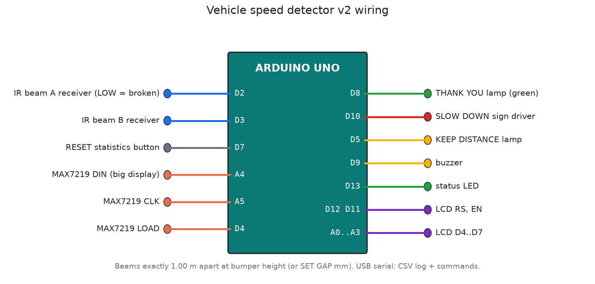
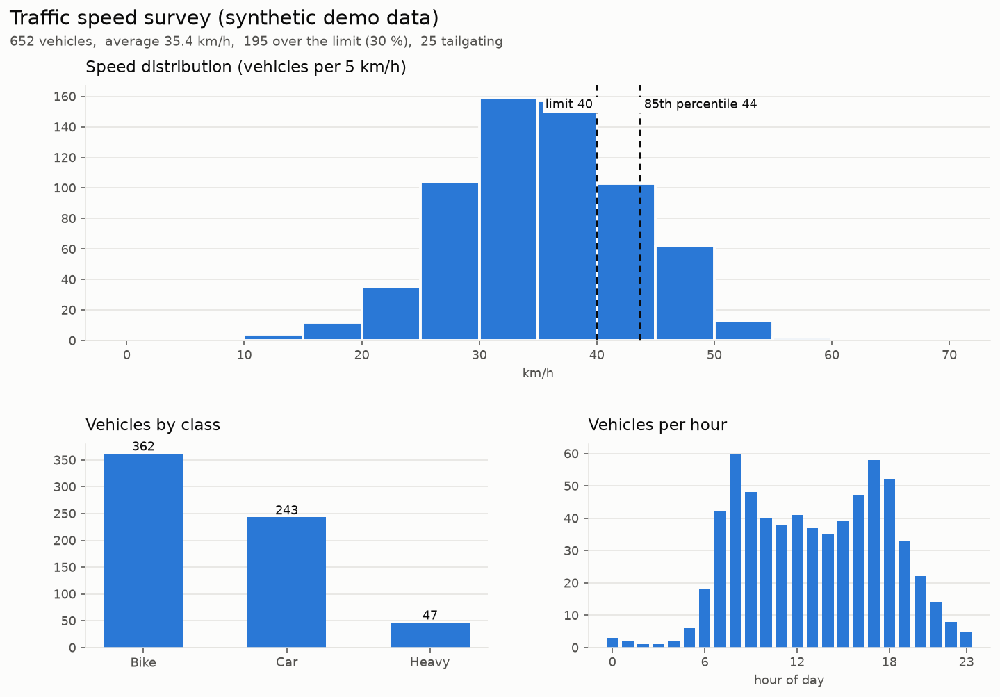

# Vehicle speed detector v2

Two infrared beams across the lane, a known distance apart. A vehicle breaks beam A, then beam B, and the time between them gives its speed. v1 stopped there. v2 also works out what kind of vehicle it was, how close it was following the vehicle ahead, and keeps the numbers a traffic engineer needs. It runs on one Arduino Uno and has nothing to subscribe to.



## Nepal demo

[`demo/nepal-speed-watch.html`](demo/nepal-speed-watch.html) is a live browser demo with four simulated sites: Kathmandu, Pokhara, Chitwan and Hetauda. It has the LED speed display, the signs in English and Nepali, live statistics, and a side-by-side comparison of the four cities. Open it in any browser. The details and the site settings are in [demo/README.md](demo/README.md). The traffic is simulated.

## What it measures

| Measurement | How |
|---|---|
| Speed | Time between the two beams, on hardware interrupts, in microseconds. At 60 km/h over a 1 m gap the vehicle takes 60 ms and the timer resolution is 4 µs, so the error is under 0.01 %. Your tape measure on site sets the real accuracy. |
| Direction | Which beam broke first (A>B or B>A) |
| Length and class | How long each beam stays blocked × speed = vehicle length. Under 2.5 m is BIKE, 2.5 to 6.5 m is CAR, over 6.5 m is HEAVY (bus or truck). |
| Headway | Front-to-front time to the previous vehicle going the same way. Under 2 s is tailgating. |

## What it does with that

- **A big 4-digit roadside display** (MAX7219, driven directly with no library) shows each driver their own speed for 5 s. It flashes when they're over the limit. People slow down more for their own number than for a fixed sign.
- **SLOW DOWN sign and beep** over the limit. Heavy vehicles get their own lower limit (default 30 km/h, cars and bikes 40). A truck at 36 km/h gets warned, a car at 36 doesn't.
- **KEEP DISTANCE lamp** when someone follows closer than 2 s.
- **Green THANK YOU lamp** for everyone within the limit.
- **Beam fault detection**: if a beam stays blocked for 30 s (knocked out of line, mud on the lens, a parked vehicle), it reports BEAM FAULT, turns off the green lamp, stops measuring, and recovers by itself once the beam is clear.
- It doesn't count things that aren't vehicles. Only one beam broken (pedestrian, dog) times out after 2 s. Both beams "breaking" at the same instant is an impossible speed and gets rejected. A bus counts once, even though it blocks both beams at the same time.

## Statistics and logs

Each vehicle produces a CSV line over USB:

```
VEHICLE,time,direction,kmh,class,length_m,headway_s,over_limit,tailgating
VEHICLE,D0 08:30:06,A>B,36.0,CAR,4.0,6.83,1,0
```

`STATS` gives the counts per class, violations, tailgating, rejected events, average, median, **85th percentile** and top speed, and vehicles per hour:

```
STATS vehicles=9 bike=1 car=6 heavy=2 unknown=0 violations=4 tailgating=1 rejected=2
STATS avg=36.9 p50=37.5 p85=39.7 top=60.0 limit=30 heavy_limit=25
STATS per_hour 8h=1
```

The 85th percentile is the speed that 85 % of drivers stay under. Traffic engineers use it to judge whether a speed limit is realistic. If it's far above the posted limit, a sign alone won't work, and the road needs calming (speed humps, narrowing).

The last 80 violations and tailgaters are stored in EEPROM, so they survive power cuts. `LOG` prints them. Records are rotated across the EEPROM with sequence numbers, with no fixed header cell that wears out.

## Settings and commands

Open a serial terminal at 9600 baud. Settings live in EEPROM with a checksum, and changing them needs the PIN (default 1234; change it first).

| Command | What it does |
|---|---|
| `HELP` | List commands |
| `STATUS` | Settings, clock, beam state, log size |
| `STATS` | Statistics, as above |
| `LOG` | Stored violations |
| `PIN 1234` | Unlock changes for 2 minutes |
| `SET LIMIT 40` | Limit for bikes and cars (km/h) |
| `SET HEAVY 30` | Limit for buses and trucks |
| `SET GAP 1000` | Measured beam spacing in mm |
| `SET TAILGATE 2000` | Minimum safe headway in ms |
| `SET PIN 4821` | New PIN |
| `TIME 08:30:00` | Set the clock, so records get time stamps and hourly counts work |
| `CLEAR STATS` / `CLEAR LOG` | Start a new survey |

## Traffic survey report

`tools/traffic_report.py` turns a captured serial log into a summary and a one-page chart. Capture the USB output to a file for a day, then:

```bash
python3 tools/traffic_report.py survey.log -o report.png --limit 40 --title "New Road, Tuesday"
```

```
Vehicles            652
  bikes / cars / heavy / unknown   362 / 243 / 47 / 0
Average speed       35.4 km/h
85th percentile     43.7 km/h
Over the limit      195 (30 %)
Posted limit        40 km/h -> the limit matches how people drive
```



The picture above uses **synthetic demo data** (`--demo` generates it), not a real survey. It shows what you get.

## Files

| File | What it is |
|---|---|
| `firmware/speed_detector/speed_detector.ino` | Firmware v2 |
| `firmware/build/speed_detector.hex` | Build |
| `tools/traffic_report.py` | Survey report from the CSV log (needs matplotlib) |
| `test/sim_test.c` | Simulator test, 41 checks |

## Building it in Proteus

1. Add `ARDUINO UNO`, `LM016L`, `MAX7219` with a `7SEG-MPX4-CC` (4-digit common-cathode display), `LED-GREEN` (THANK YOU), `LED-RED` (SLOW DOWN), `LED-YELLOW` (KEEP DISTANCE), `BUZZER`, `BUTTON`, and 2 × `BUTTON` or `LOGICSTATE` to stand in for the beams. Add a `VIRTUAL TERMINAL` on D0/D1 at 9600 baud for the commands and log.
2. Wire it as in `images/wiring.png`. The MAX7219 needs a 10k resistor on ISET.
3. Set the Arduino's Program File to `firmware/build/speed_detector.hex` and run it.
4. Two `PULSE` generators make exact speeds. Beam B starting 60 ms after beam A is 60 km/h. A pulse width of 120 ms at that speed is a 2 m motorbike, and 700 ms is a 12 m bus.
5. In the virtual terminal, type `PIN 1234`, then `TIME 08:00:00`, then `STATS`.

Save it as `proteus/speed-detector.pdsprj` and commit it.

## In the field

- Use modulated outdoor IR beam pairs or laser break-beam modules. Plain IR LEDs are blinded by sunlight.
- Mount them at bumper height (40 to 60 cm), on rigid posts, one lane only. Measure the gap to the millimetre and `SET GAP` it.
- The headway check needs the first vehicle to clear both beams before the next one arrives. In stop-and-go traffic, very close vehicles merge into one record.
- This is a speed awareness and survey device, not certified enforcement equipment. Fines need a type-approved and calibrated device.

## Testing

`tools/test_all.sh` runs the test. It checks:

- speed, direction, class and length for a car, a motorbike, a bus and a truck
- the number on the big display and its flashing
- the heavy-vehicle limit, and the tailgating flag and lamp
- the pedestrian and glitch rejection
- the PIN lock, a wrong PIN, saving settings, and lower-case commands
- the clock and time stamps, statistics per class, the 85th percentile and hourly counts
- the EEPROM log, and that settings and log survive a power cut
- a 30 s beam fault and recovery, and clearing the log
