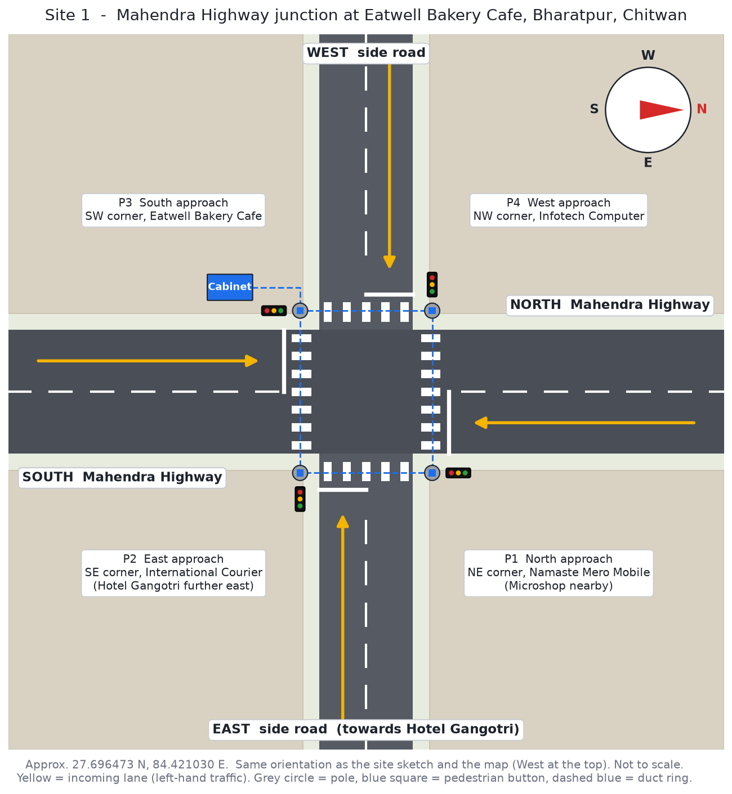
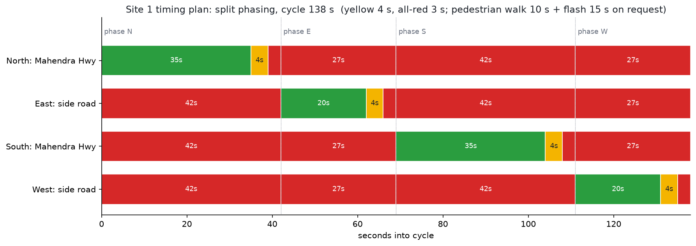

# Site 1: Mahendra Highway junction at Eatwell Bakery Cafe, Bharatpur

Everything for traffic signal Site 1 is in this folder: the site layout, the firmware built for this junction, ready HEX files, the Proteus project, the timing plan, the bill of materials, and the installation and commissioning checklist.

| | |
|---|---|
| Location | Mahendra Highway, Bharatpur, Chitwan, Bagmati Province, Nepal |
| Landmark | Eatwell Bakery Cafe (south-west corner) |
| Coordinates | approx. 27.696473 N, 84.421030 E ([open in Apple Maps](https://maps.apple.com/place?address=Mahendra%20Highway,%20Bharatpur,%20Nepal&coordinate=27.696473,84.421030&name=Eatwell%20Bakery%20Cafe&place-id=IA238CD8C789DE3E4&map=h)) |
| Junction type | "+" cross road, 4 arms, 4 signal poles |
| Controller | Arduino Uno with this folder's firmware, `BRT-EATWELL` |
| Status | Design ready, tested in the simulator and in Proteus. Timings to be approved before switch-on. |



## The junction

My site sketch ([photos/site01-hand-sketch.jpg](photos/site01-hand-sketch.jpg)) and the map both put West at the top. The layout drawing above keeps that orientation, so all three line up.

| Firmware arm | On the ground | Pole | Corner | Shop at the corner |
|---|---|---|---|---|
| North (D2-D4) | Mahendra Highway, north arm | P1 | NE | Namaste Mero Mobile (Microshop nearby) |
| East (D5-D7) | Side road, east arm, towards Hotel Gangotri | P2 | SE | International Courier and Super Kinetic Courier |
| South (D8-D10) | Mahendra Highway, south arm | P3 | SW | Eatwell Bakery Cafe |
| West (D11-D13) | Side road, west arm | P4 | NW | Infotech Computer |

We drive on the left, so each pole stands on the near-left corner of the approach it controls, just behind the stop line. The sketch shows the same: every signal head sits on the incoming (left) lane.

## Timing plan



| Setting | Value | Why |
|---|---|---|
| Phasing | Split: N, then E, then S, then W | Right-turning traffic crosses the oncoming lane. On a national highway with buses and trucks, giving each arm its own green is the safe choice without separate turn arrows. |
| Green, highway (N, S) | 35 s each | Mahendra Highway carries most of the traffic |
| Green, side road (E, W) | 20 s each | Local traffic, shorter queues |
| Yellow | 4 s | For an approach speed of about 50 km/h: 1 s reaction + 13.9 / (2 × 3) ≈ 3.3 s, rounded up |
| All-red | 3 s | A vehicle at 50 km/h needs about (20 m junction + 5 m vehicle) / 13.9 ≈ 1.8 s to clear. 3 s gives a margin for trucks and slow motorbikes. |
| Pedestrian | 10 s WALK + 15 s flashing, on button request | About 15 m of highway to cross at 1.2 m/s ≈ 12.5 s, so the flashing time covers someone who started at the end of WALK |
| Cycle | 138 s (163 s with a pedestrian phase) | |
| Night | Flashing yellow on all arms from a 24 h timer (suggested 23:00 to 05:00) | |

The junction width (about 20 m) and crossing length (about 15 m) are my estimates from the map. Measure them on site. If they're very different, change the yellow, all-red and pedestrian times in the `SITES` table of the firmware. **The traffic police (Chitwan) and the road authority must approve these timings before switch-on.**

## Files

| Path | What it is |
|---|---|
| `firmware/traffic_controller_site01/traffic_controller_site01.ino` | Site 1 firmware: the tested controller with this junction's profile and arm names built in |
| `firmware/build/traffic_controller_site01.hex` | Real-time HEX for the board installed at the junction |
| `firmware/build/traffic_controller_site01_sim_x5.hex` | 5x faster HEX for Proteus demos (one cycle in about 28 s) |
| `proteus/site01-bharatpur-eatwell.pdsprj` | Proteus project with the Site 1 sketch inside |
| `images/site01-layout.png` | Labelled junction layout with the poles, shops, lanes and cabinet |
| `images/site01-timing.png` | Timing plan |
| `images/site01-wiring.png` | Controller wiring (same pin map as the main project) |
| `images/site01-field-hardware.png` | Cabinet, power and lamp driver block diagram |
| `photos/site01-hand-sketch.jpg` | My site sketch (location data removed from the photo) |
| `docs/BILL_OF_MATERIALS.md` | Everything to buy for this junction |
| `docs/INSTALLATION_AND_COMMISSIONING.md` | Installation steps and the switch-on checklist, with sign-off |
| `site.json` | Site data in one file (location, arms, poles, timings) |
| `test/test-report.txt` | Latest simulator test result for this firmware |
| `tools/build.sh`, `tools/test.sh`, `tools/make_images.py` | Rebuild the HEX, rerun the test, redraw the images |

## Running it in Proteus

1. Open `proteus/site01-bharatpur-eatwell.pdsprj`, or your own working schematic.
2. Double-click the Arduino. Set **Program File** to `firmware/build/traffic_controller_site01_sim_x5.hex` and **Clock** to 16 MHz.
3. Run it. In the virtual terminal (9600 baud) the board introduces itself with this site's arms:

```
[S01 BRT-EATWELL t=0s] Traffic controller v2.0.0 boot, reset=POWER-ON
[S01 BRT-EATWELL t=0s] 4 phases, plan=SPLIT
[S01 BRT-EATWELL t=0s] N  Mahendra Hwy north  (P1, NE corner, Namaste Mero Mobile)
[S01 BRT-EATWELL t=0s] E  side road east      (P2, SE corner, International Courier)
[S01 BRT-EATWELL t=0s] S  Mahendra Hwy south  (P3, SW corner, Eatwell Bakery Cafe)
[S01 BRT-EATWELL t=0s] W  side road west      (P4, NW corner, Infotech Computer)
[S01 BRT-EATWELL t=0s] STARTUP_RED for 5s
[S01 BRT-EATWELL t=1s] GREEN N for 35s
```

The order on the LEDs is North (highway) green, then East, South (highway) and West, with yellow and all-red between each. Type `s` for a status report.

The wiring is the same pin map as the main traffic project (D2 to D13 for the four heads, A0 night, A1 emergency, A2 pedestrian button, A3/A4 pedestrian lamps). See `images/site01-wiring.png`.

## Flashing the real controller

```bash
avrdude -p m328p -c arduino -P /dev/ttyUSB0 -b 115200 \
  -U flash:w:firmware/build/traffic_controller_site01.hex:i
```

Or open the `.ino` in the Arduino IDE and upload it. Use the real-time HEX on site, never the `_sim_x5` one.

## Tested

`tools/test.sh` runs the traffic controller safety test against this exact firmware. It checks every approach getting green, the pedestrian phase, night flash, the emergency hold and recovery, and that two conflicting greens never appear in any simulated millisecond. A second build forces a conflict to prove the FAULT latch. The latest result is in [test/test-report.txt](test/test-report.txt): **all checks pass**. You also ran the `_sim_x5` HEX in Proteus and it works.

## Before switch-on

- Get the timing plan approved by the traffic police and the road authority.
- Measure the junction and crossing widths, and adjust the timings if needed.
- Get written permission for the pole and cabinet positions, especially on shop frontages.
- Work through [docs/INSTALLATION_AND_COMMISSIONING.md](docs/INSTALLATION_AND_COMMISSIONING.md) and sign it off.
