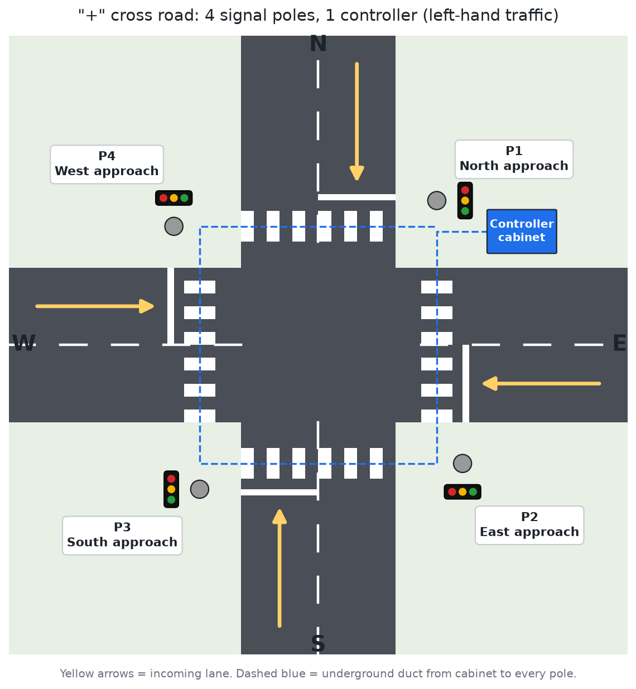
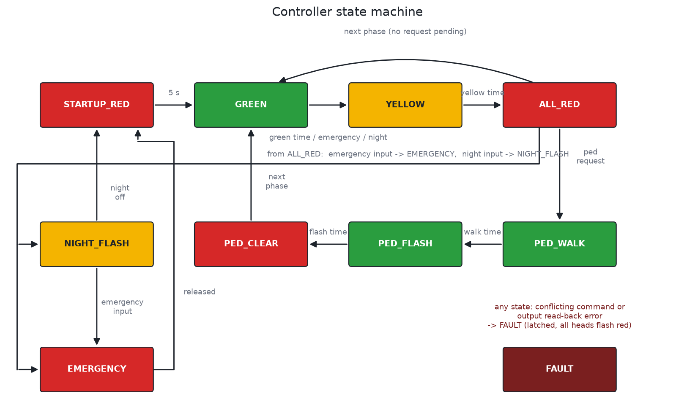
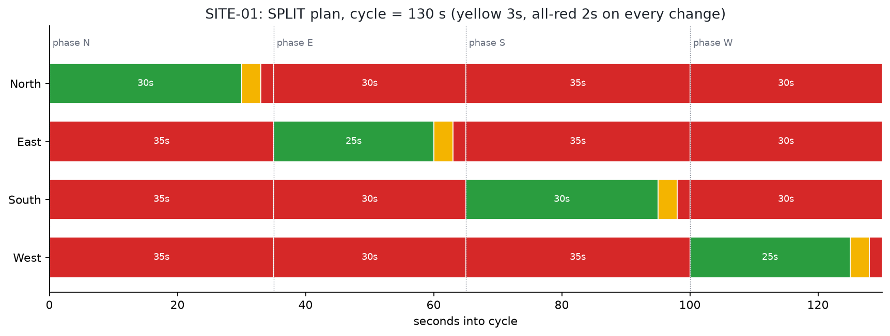
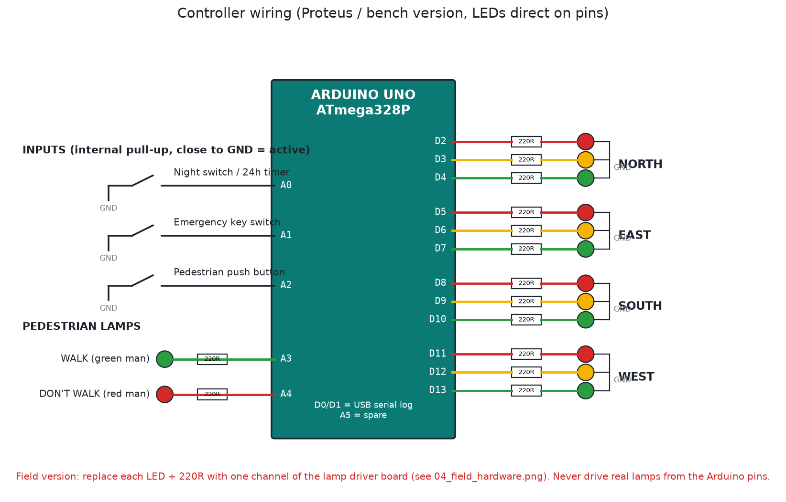

# Traffic light controller (4-way junction, 8 sites)

This is the controller I'm building for 8 junctions. Every junction is a "+" cross road, so each one has 4 signal heads (North, East, South, West) and one cabinet with an Arduino Uno. All 8 boxes run the same firmware. The only thing that changes from site to site is `SITE_ID` (1 to 8), which picks that junction's timings.

The older files in this folder (`traffic light controller .pdsprj`, `design 1`, the backups) are from my first version in July 2023. I left them alone so the history is still there. Version 2 lives in the folders listed below.



## What's in here

```
traffic-light-controller/
├── firmware/
│   ├── traffic_controller/traffic_controller.ino   main sketch (Arduino IDE / Proteus)
│   └── build/                                      ready HEX files
│       ├── traffic_controller_site01.hex ... site08.hex   real timing, one per site
│       ├── traffic_controller_site01_sim_x5.hex           5x faster, for Proteus demos
│       └── traffic_controller_site05_sim_x5.hex           same, opposing plan
├── proteus/traffic-junction-4way.pdsprj           Proteus 8 project with the new code inside
├── images/                                        PNG diagrams (layout, wiring, timing, ...)
├── docs/
│   ├── PROTEUS_GUIDE.md        draw and run the simulation
│   ├── INSTALLATION_GUIDE.md   field install for a "+" junction, 4 poles
│   ├── SITE_REGISTER.md        the 8 sites, one row each
│   └── TESTING.md              simulator test, bench test, handover checklist
└── tools/
    ├── build_hex.sh            builds all 8 HEX files without the Arduino IDE
    ├── make_diagrams.py        regenerates the PNGs
    └── test/sim_test.c         automatic safety test (simavr)
```

## How it works

The sketch is a state machine. Nothing in the control path uses `delay()`, so inputs are read all the time and the watchdog keeps getting fed.

Every change of right of way goes green, then yellow, then all-red, then the next green. The all-red gap gives the box junction time to clear before anyone else moves.



There are two phase plans, and you choose one per site in the `SITES` table:

- `PLAN_SPLIT`: one approach at a time (N, E, S, W). This is the default. In Nepal we drive on the left, so right-turners cross the oncoming stream, and split phasing is the only plan that keeps right turns safe without separate arrow heads.
- `PLAN_OPPOSING`: N+S together, then E+W together. The cycle is shorter, but use it only where right turns are banned or traffic is light.



### Inputs and outputs

| Pin | Use |
|---|---|
| D2 D3 D4 | North R Y G |
| D5 D6 D7 | East R Y G |
| D8 D9 D10 | South R Y G |
| D11 D12 D13 | West R Y G |
| A0 | Night mode. Pull it to GND (24 h timer or photocell) and all heads flash yellow |
| A1 | Emergency hold. Pull it to GND (key switch) and all heads go red after a normal yellow |
| A2 | Pedestrian button. One press books a walk phase at the next all-red |
| A3 / A4 | Pedestrian WALK / DON'T WALK |
| D0 / D1 | USB serial log, 9600 baud |



### Safety

I care more about this part than any of the features.

- Before any pattern reaches the pins, a conflict monitor checks it against the phase plan. Two crossing greens, a green and a red on the same head, or WALK while traffic is moving all count as a conflict.
- After writing the pins, the firmware reads them back. If the read-back disagrees 3 times in a row (a shorted or stuck output), it treats that the same way.
- Either one latches FAULT: every head flashes red and the box stays like that until someone opens the cabinet and power-cycles it. It does not recover on its own, and that's on purpose.
- A 2 second hardware watchdog resets the chip if the code ever hangs. After any reset the junction holds all-red for 5 s before the first green.
- Leaving night mode or emergency always goes through all-red. It never jumps straight to green.
- Timings are clamped at boot: green 7 to 120 s, yellow at least 3 s, all-red at least 1 s.
- The serial port is read only (`s` for status, `h` for help). Someone with a laptop at the cabinet can see what's happening but can't change anything.

## Quick start

1. Simulation: follow [docs/PROTEUS_GUIDE.md](docs/PROTEUS_GUIDE.md). The short version is to open `proteus/traffic-junction-4way.pdsprj` or draw the circuit from the wiring picture, then point the Arduino at `firmware/build/traffic_controller_site01_sim_x5.hex`.
2. Arduino IDE: open `firmware/traffic_controller/traffic_controller.ino`, set `SITE_ID`, choose "Arduino Uno" and upload.
3. Command line: run `tools/build_hex.sh` to rebuild all 8 HEX files.
4. Field: [docs/INSTALLATION_GUIDE.md](docs/INSTALLATION_GUIDE.md) and [docs/SITE_REGISTER.md](docs/SITE_REGISTER.md).

## Changing timings for a site

Edit the matching row in the `SITES` table near the top of the sketch:

```cpp
//  name        arms       plan           N   E   S   W   Y  AR  PW  PF
{ "SITE-01", APP_CROSS, PLAN_SPLIT,    { 30, 25, 30, 25 }, 3, 2, 12, 6 },
```

`arms` is `APP_CROSS` for a "+" junction. For a T junction, leave out the missing arm, for example `APP_N | APP_E | APP_W`. The firmware then skips that phase and keeps the missing head dark.

If you change timings, also update `SITES` in `tools/make_diagrams.py` and rerun it so the PNGs stay correct.

## Status

- Firmware compiles to about 6 KB of flash and 630 bytes of RAM on the ATmega328P.
- `tools/test/sim_test.c` runs the real compiled code in simavr and checks the normal cycle, the pedestrian request, night flash, emergency hold and recovery. It also checks for conflicts every simulated millisecond. Both phase plans pass.
- I haven't opened the `.pdsprj` in Proteus after this change (Proteus is Windows only). Read the note in the Proteus guide before you trust the schematic inside it.

Author: Pradip Subedi ([sprasapradip](https://github.com/sprasapradip))
